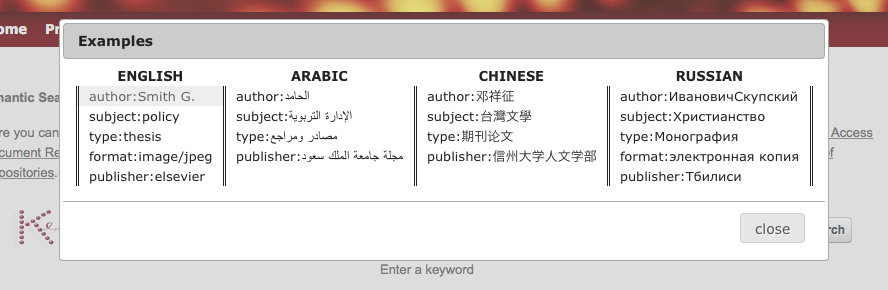
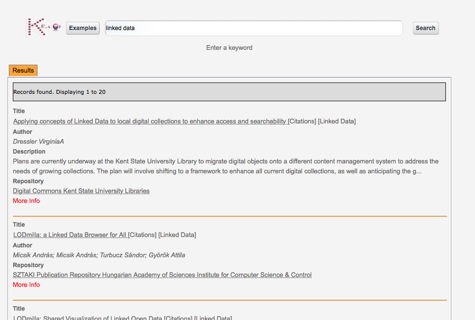
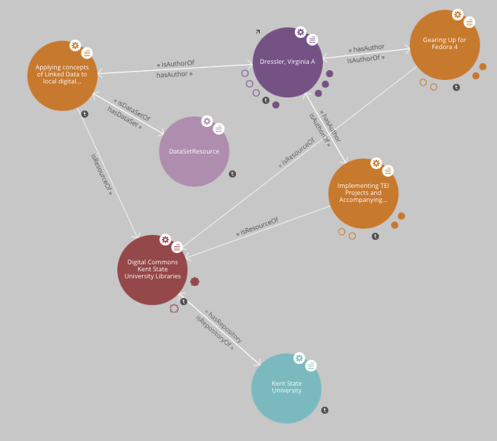

***************
SEMANTIC SEARCH
***************

============
About
============

 

.. line-block:: The Semantic Search portlet aims to correlate enriched `Open Access Document Repositories <http://www.chain-project.eu/knowledge-base?p_p_id=ChainMap_WAR_ChainMap&p_p_lifecycle=0&p_p_state=normal&p_p_mode=view&p_p_col_id=column-1&p_p_col_count=1&tabs1=OADR%20Map>`_ and `Data Repositories <http://www.chain-project.eu/knowledge-base p_p_id=ChainMap_WAR_ChainMap&p_p_lifecycle=0&p_p_state=normal&p_p_mode=view&p_p_col_id=column-1&p_p_col_count=1&tabs1=DR%20Map>`_ to create linked data and discover new knowledge through semantic enrichment of metadata. The user can search in more than 100 languages across more than 30 million resources contained in the thousands of semantically enriched  OADRs and DRs included in the CHAIN Knowledge Base. Search results are ranked according to the `Ranking Web of Repositories <http://repositories.webometrics.info/>`_. 

============
Installation
============
To install this portlet the WAR file has to be deployed into the application server.

============
Usage
============
The search can be performed:

- .. line-block:: By typing one or more keywords in the textbox search. After entering the search string, clicking the "Search" button the system submit a SPARQL query that retrieve the results from the CHAIN-REDS repository.
 
 Example of query to retrieve the resources with the keyword in title.    
    
     SELECT distinct ?s  WHERE {
                                ?s dc:title ?title.
                                ?title bif:contains " + keyword + ".
                                ?s <http://semanticweb.org/ontologies/2013/2/7/RepositoryOntology.owl#isResourceOf> ?rep.
                                ?rep <http://www.semanticweb.org/ontologies/2013/2/7/RepositoryOntology.owl#rank> ?rank.
                                }ORDER BY ASC(?rank) limit 20 offset 0   

  

 

- .. line-block:: Using search filters. Inserting in textbox search string, for example, "author: G. Smith" and clicking "Search" will be launched a SPARQL query that will return only the resources of CHAIN-REDS  that have at least one author who matches "Smith G.". The possible filters (according to the Dublin Core Standard) are : dc: author, dc: subject dc: type and dc: publisher. Clicking the "Examples" button are show examples of search filters in 4 of the 110 languages supported by the system.

In both cases the results of the query will be processed further, to obtain the final results, as shown in Figure

Clicking on "More Info" link you can access all the details of the resource.

Clicking  on “[Citations]” link, if available, are dispayed more information from Google Scholar about the versions and the quotations of the resource.

Clicking  on “[Linked Data]” link will be open a new tab that shows a `LodLive <http://www.lodlive.it>`_ graph of the resource with all its metadata.

============
References
============
-  ‘A CHAIN-REDS Perspective about Data Access and Metadata Management’. 3rd International Platform on Integrating Arab e-infrastructure in a Global Environment, e-AGE 2013. December 12-13, 2013. Tunisia. [`1 <http://www.asrenorg.net/eage2013/en/content/program>`_]

- The CHAIN-REDS Semantic Search Engine.[`2 <http://www.ubuntunet.net/sites/default/files/barberar.pdf>`_] 

- Science Gateways for Semantic-Web- Based Life Science Applications. Studies in Health Technology and Informatics, Volume 175: HealthGrid Applications and Technologies Meet Science gateways for Life Sciences, pp 119-130. DOI: 10.3233/978-1-61499-054-3-119 [`3 <http://ebooks.iospress.nl/volumearticle/21423>`_]

- The CHAIN-REDS Knowledge Base and Semantic Search Engine. e-Infrastructures for e-Sciences 2013. A CHAIN-REDS Workshop organised under the eagis of the European Commission (eleS2013). October 22, 2013 Beijing, P.R. of China. [`4 <http://pos.sissa.it/archive/conferences/199/016/eIeS2013_016.pdf>`_]

- A CHAIN-REDS solution for accessing computational services. Cuarta Conferencia de Directores de Tecnología de Información, TICAL2014 Gestión de las TICs para la Investigación y la Colaboración, Cancún, del 26 al 28 de mayo de 2014.[`5 <http://tical2014.redclara.net/doc/TICAL2014_ACTAS.pdf>`_] 

- CHAIN-REDS application use cases on data management. “4th International Platform on Integrating Arab e-Infrastructure in a Global Environment, e-AGE 2014” to be held in Grant Hyatt Muscat, Oman, 10 – 11 December, 2014.[`6 <http://asrenorg.net/eage2014/sites/default/files/files/e-AGE%202014%20Proceedings.pdf>`_]

- CHAIN-REDS DART Challenge. Biredial-ISTEC 2014, At Porto Alegre, Rio Grande du Sul Brazil.  DOI: 10.13140/2.1.3532.8961 [`7 <http://www.researchgate.net/publication/267638728_CHAIN-REDS_DART_Challenge?channel=doi&linkId=545698460cf2bccc490f2aa3&showFulltext=true>`_]

=============
Contributors
=============
Please feel free to contact us any time if you have any questions or comments.

.. _INFN: http://www.ct.infn.it/

:Authors:

 `Rita RICCERI <mailto:rita.ricceri@ct.infn.it>`_ - Italian National Institute of Nuclear Physics (INFN_),

 `Giuseppina INSERRA <mailto:giuseppina.inserra@ct.infn.it>`_ - Italian National Institute of Nuclear Physics (INFN_), 

 `Carla CARRUBBA <mailto:carla.carrubba@ct.infn.it>`_ - Italian National Institute of Nuclear Physics (INFN_)
 

